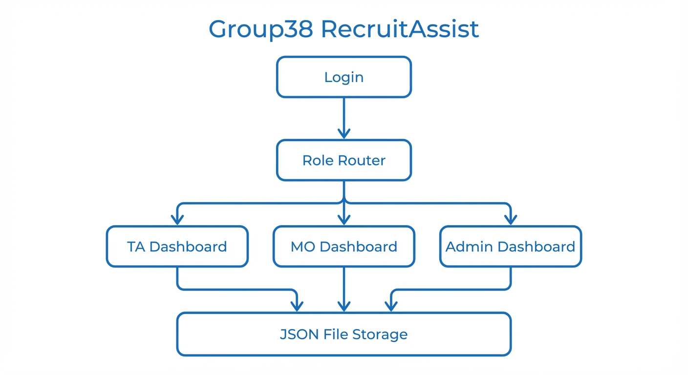

# Group38-TA_Recruitment

Repository of Java-based software design focusing on TA recruitment.

## Project Overview

**RecruitAssist** is a Teaching Assistant recruitment management system built with Java Servlet + JSP. It supports three user roles — TA (Teaching Assistant), MO (Module Organiser), and Admin — each with dedicated dashboards for managing applications, reviewing candidates, and balancing workloads. All data is persisted via JSON file storage.

### System Architecture

### Recommendation Engine

## Team Members

|      Name      | Github Username | CN Student Number | UK Student Number |
|----------------|-----------------|-------------------|-------------------|
|     Yi Qi      |     yi-Q945     |   2021212846      |     210979239     |
|  Tianyu Zhao   |                 |                   |                   |
|    Jie Ren     |    JieJieSAM    |   2023213308      |   231223003       |
|  Haopeng Jin   |   Sunbeam23333  |   2023213296      |   231221744       |
|   Zhuang Hou   |     qiye-cv     |   2023213302      |   231220448       |
|  Zexuan Dong   |   GuMiShDo666   |   2023213310      |                   |
