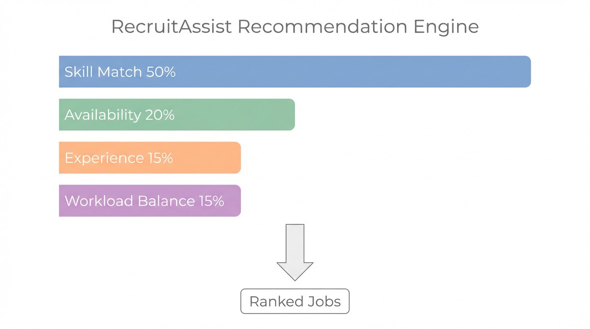

# RecruitAssist

> English version: [README.md](./README.md)

`RecruitAssist` 是一个面向 **教学助理（Teaching Assistant）招聘流程** 的轻量级 **Java Servlet/JSP 原型系统**。项目适合课程作业展示、快速本地预览和原型演示，核心特点包括：**角色化仪表盘**、**可解释岗位推荐**、以及**无需数据库的文件存储方案**。

## 项目示意图

### 软件整体结构


### 推荐系统结构



## 项目亮点

- **3 类演示角色**：TA、MO（课程负责人 / Module Organiser）、Admin
- **可解释推荐机制**：综合技能、时间、经验、工作量平衡、资料证据与竞争压力
- **角色化 Dashboard**：登录后按身份进入不同页面和操作流
- **统一岗位详情页**：根据 TA / MO / Admin 展示不同内容与动作
- **纯文本存储**：使用 JSON / CSV / TXT，无需额外数据库部署
- **适合 Demo 展示**：覆盖申请、撤回、发布、关闭、重开、审核、工作量监控等流程

## 角色与演示功能

| 角色 | 示例账号 | 可演示内容 |
| --- | --- | --- |
| TA | `alice.ta`、`ben.ta` | 查看推荐岗位、阅读匹配解释、提交申请、撤回申请、查看个人工作量 |
| MO | `mo.chen`、`recruiter.01` | 创建岗位、编辑岗位、关闭 / 重开岗位、查看候选人排序、更新申请状态 |
| Admin | `admin.sarah` | 查看工作量平衡、监控近期申请动态、从运营视角检查系统状态 |

> 当前演示账号统一密码：`demo123`  
> 该密码仅用于课程演示，**不适用于生产环境**。

## 当前已实现功能

- 角色化登录与登录后路由分流
- TA 推荐岗位列表与可解释评分
- 岗位申请提交与撤回
- MO 发布、编辑、关闭、重开岗位
- 候选人排序查看与状态更新
- Admin 工作量总览与近期申请监控
- 基于文件的用户、岗位、申请与审计记录持久化
- 通过 `scripts/generate_demo_load.py` 批量生成更高负载演示数据

## 技术栈

- **Java 17**
- **Maven**
- **Jakarta Servlet 6**
- **JSP + JSTL**
- **Gson**
- **WAR 打包**
- **JSON / CSV / TXT** 文件存储

## 目录结构

```text
RecruitAssist/
├── data/                       # 用户、岗位、申请、系统配置等种子数据
├── figure/                     # README 配图与展示素材
├── framework/
│   └── recruitassist-web/      # Java Web 应用主体（Servlet/JSP）
├── logs/                       # 运行日志和审计日志
├── scripts/                    # Java / Maven 启动辅助脚本与 seed 生成脚本
└── README.md / README_zh.md
```

## 本地启动

### 环境要求

- Java 17
- Maven 3.9+
- 在 macOS 上可以直接使用仓库里的 `scripts/` 辅助脚本

### 可选：先生成更大规模的演示数据

在项目根目录执行：

```bash
python3 scripts/generate_demo_load.py
```

默认会把 seed 数据扩充到更适合高并发 / 高负载演示的规模，新增更多 TA / recruiter 账号、岗位、申请记录以及部分示例 CV 文本文件。

### 使用仓库自带脚本启动

在项目根目录执行：

```bash
RECRUITASSIST_BASE_DIR=$(pwd) zsh scripts/mvn17.sh -f framework/recruitassist-web/pom.xml org.eclipse.jetty.ee10:jetty-ee10-maven-plugin:12.0.15:run -Djetty.http.port=8081 -Djetty.contextPath=/
```

然后浏览器访问：

```text
http://127.0.0.1:8081/
```

### 使用你自己的 Java / Maven 环境启动

```bash
cd framework/recruitassist-web
RECRUITASSIST_BASE_DIR=$(cd ../.. && pwd) mvn org.eclipse.jetty.ee10:jetty-ee10-maven-plugin:12.0.15:run -Djetty.http.port=8081 -Djetty.contextPath=/
```

## 建议演示路径

1. **先以 TA 登录**，展示推荐岗位与匹配解释。
2. 进入 **岗位详情页**，演示提交申请。
3. 切换到 **MO**，查看候选人列表与推荐排序。
4. 演示修改申请状态，或关闭 / 重开岗位。
5. 最后切到 **Admin**，说明工作量监控与分配公平性的价值。

## 数据与配置

本项目采用 **纯文本文件存储**：

- `data/users/`：用户资料与演示账号
- `data/jobs/`：岗位数据
- `data/applications/`：申请记录
- `data/system/config.json`：推荐和工作量相关配置
- `logs/access/audit.csv`：审计日志

当前推荐权重配置包括：

- 技能匹配：`0.4`
- 时间可用性：`0.12`
- 经验证据：`0.18`
- 工作量平衡：`0.12`
- 资料证据：`0.10`
- 竞争压力：`0.08`

这些参数可以在 `data/system/config.json` 中调整。

## 推荐引擎说明

`RecruitAssist` 的核心亮点之一是 **可解释推荐引擎**。系统不会只把开放岗位平铺出来，而是会根据以下信号计算综合匹配分：

- 技能重叠与别名归一匹配
- 时间可用性描述质量
- 个人经历 / CV 证据
- 预计工作量影响
- 岗位竞争压力
- 已体现在文本匹配链路中的 programme 与岗位语义上下文

因此，它不仅适合做功能演示，也适合讨论“岗位分配是否合理、是否公平”这类课程问题。

## 说明

- 这个项目更适合定位为 **课程原型 / Demo 系统**，而不是生产环境招聘平台。
- 登录与账号设计为演示用途，故意保持了较低复杂度。
- 项目重点在于：**快速启动、种子数据可演示、业务流程讲解清晰**。
